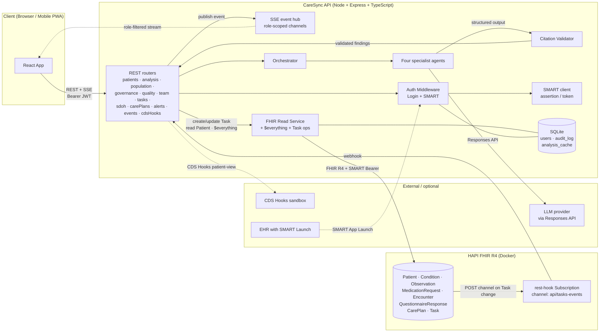
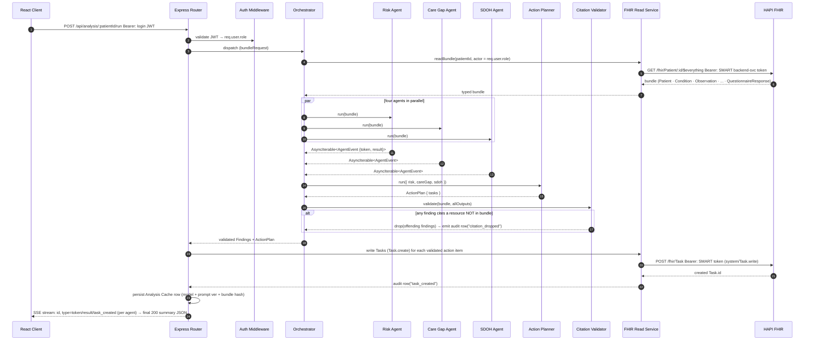
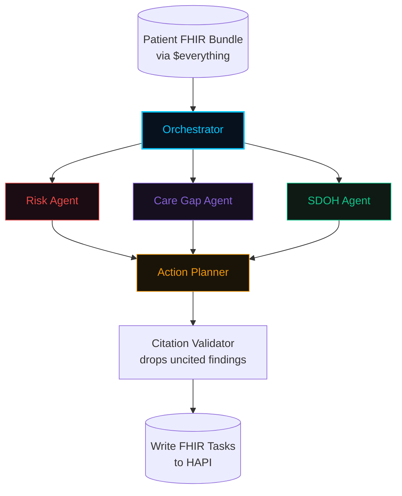
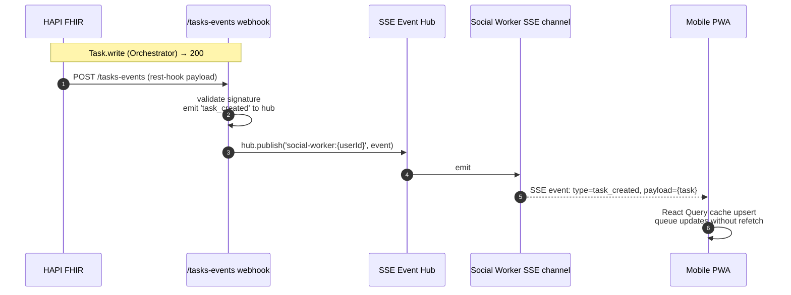
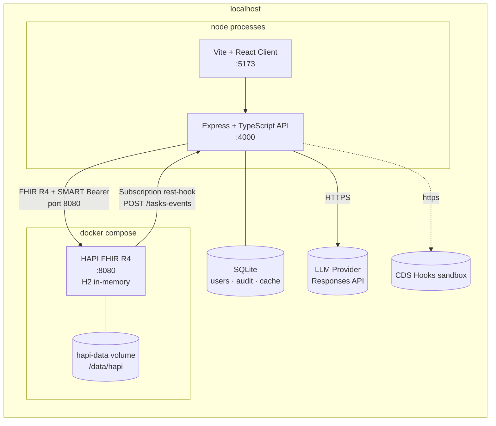
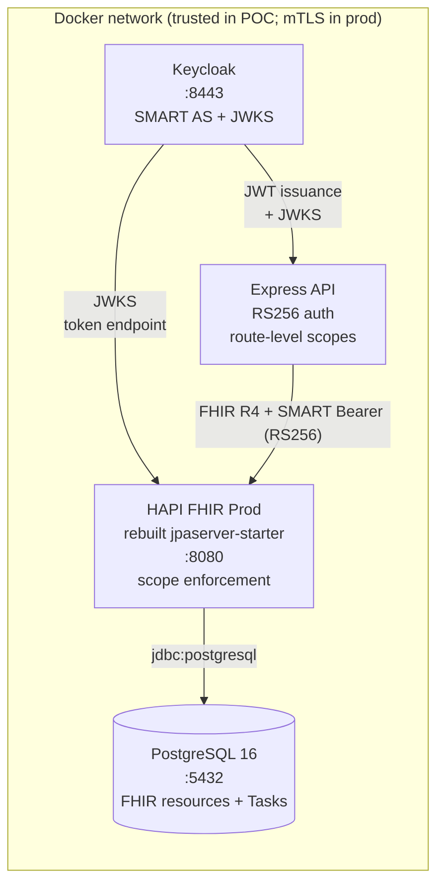

# CareSync AI — Technical Architecture

> **Purpose:** A complete technical reference for the CareSync AI platform — the
> pieces, how they fit, the multi-agent AI subsystem in detail, the standards
> integration, the security model, and the path from POC to production. Written
> for architects, integrators, security/AI-trust reviewers, and HL7 AI
> Challenge evaluators.
>
> **Status:** POC, submitted to the HL7 AI Challenge 2026. Production hardening
> is fully scoped and described in §17.

---

## Table of contents

1. [Architecture principles](#1-architecture-principles)
2. [System overview](#2-system-overview)
3. [Component map](#3-component-map)
4. [Frontend architecture](#4-frontend-architecture)
5. [Backend architecture](#5-backend-architecture)
6. [Data layer](#6-data-layer)
7. [Multi-agent AI subsystem](#7-multi-agent-ai-subsystem)
8. [Generative AI usage — deep dive](#8-generative-ai-usage--deep-dive)
9. [Citation enforcement — the safety property](#9-citation-enforcement--the-safety-property)
10. [Standards integration](#10-standards-integration)
11. [Security & authorization model](#11-security--authorization-model)
12. [Real-time & eventing](#12-real-time--eventing)
13. [Deployment architecture](#13-deployment-architecture)
14. [Observability & evaluation harness](#14-observability--evaluation-harness)
15. [Performance & cost characteristics](#15-performance--cost-characteristics)
16. [Test seams & CI posture](#16-test-seams--ci-posture)
17. [POC → production roadmap](#17-poc--production-roadmap)
18. [Appendix — glossary](#18-appendix--glossary)

---

## 1. Architecture principles

The architecture was constrained from day one by **four invariant principles** —
non-negotiables that informed every later decision:

1. **Standards are load-bearing, not decorative.** Every patient data exchange
   is FHIR R4. Every authorization is SMART on FHIR. Every delivery surface
   is either REST, FHIR Subscription, or CDS Hooks. No proprietary schema.
2. **The AI cannot invent evidence.** Every AI-issued `fhirResourceId` is
   validated against the retrieved bundle at the API seam. A citation that
   doesn't resolve is dropped before it reaches the UI or becomes a FHIR Task.
3. **Every read and every write is auditable.** A successful or failed FHIR
   read, every agent dispatch, every Task transition — all of it logs to the
   audit table with timestamp, user, resource type, and resource ID.
4. **Honest staging.** What's built and running is labeled as built. What's
   envisioned is labeled envisioned. Where the eval harness flags a flaw, we
   fix it (or document why) before claiming a pillar score.

These four principles are why the system looks the way it does.

---

## 2. System overview

### 2.1 One-paragraph tour

CareSync is a monorepo with two services — a React/Vite/TypeScript web
client and an Express/TypeScript API — plus a HAPI FHIR R4
server (Docker) as the system of record for clinical data and FHIR Tasks, and
SQLite for app-side state (users, sessions, audit log, analysis cache). The
API runs four AI agents in parallel over a patient's `$everything` bundle,
streams their findings back to the client over Server-Sent Events, validates
every cited resource ID against the bundle, writes the resulting FHIR Tasks
to HAPI, and registers a HAPI rest-hook Subscription so subsequent Task
changes reach the mobile client within seconds.

### 2.2 High-level architecture (component + protocol view)



### 2.3 Process & data boundaries

| Boundary | What lives on each side |
|---|---|
| **Client ↔ API** | JSON over HTTPS + Server-Sent Events. Bearer JWT for auth. CORS enforced. |
| **API ↔ HAPI** | FHIR R4 REST (resources) + SMART on FHIR Bearer tokens for auth. Subscription rest-hook callbacks signed with shared secret at the application layer. |
| **API ↔ LLM provider** | OpenAI Responses API. Structured output (tool-use shape) for citation enforcement. |
| **API ↔ CDS Hooks sandbox** | Standard CDS Hooks service registration + `patient-view` discovery + per-request cards. |

---

## 3. Component map

### 3.1 Service inventory

| Service | Runtime | Purpose |
|---|---|---|
| Web client | Vite + React 18 + TypeScript | Director + Coordinator dashboard, mobile PWA shell |
| API | Node + Express + TypeScript | All non-FHIR business logic, agent orchestration, SSE hub |
| HAPI FHIR | HAPI FHIR R4 in Docker | System of record for clinical data + Tasks |
| SQLite | Embedded | Users, audit log, analysis cache |
| LLM Provider | SaaS (OpenAI Responses API) | LLM provider for all four agents |
| CDS Hooks sandbox | Public SaaS | Demo target for the CDS Hooks service |
| Keycloak | Docker (production) | SMART authorization server |
| PostgreSQL | Docker (production) | HAPI backing store |
| HAPI jpaserver-starter | Docker (production) | Production HAPI with scope enforcement |

### 3.2 Repository layout

The repository is organized as a monorepo with two application packages — a
Node/Express/TypeScript backend and a React/Vite/TypeScript frontend — plus
supporting directories for documentation, reference materials, evaluation
reports, and Docker orchestration. The backend is modularly structured with
dedicated modules for agent orchestration, authentication, FHIR integration,
governance, quality measures, SDOH processing, alerts, population analytics,
team management, and data seeding. The frontend follows a one-page-per-screen
convention with shared components, an API client layer, and role-based auth
context.

---

## 4. Frontend architecture

### 4.1 Stack

| Layer | Choice | Why |
|---|---|---|
| Framework | React 18 + TypeScript | Mature ecosystem, typed props match API contracts |
| Bundler | Vite | Fast dev loop; HMR for the streaming SSE UI |
| Routing | React Router v6 | Role-based landing + nested surfaces |
| Data | TanStack Query | Cache invalidation on Task transitions (matches SSE-driven updates) |
| Styles | TailwindCSS | Utility classes map cleanly to the design-token CSS variables |
| Real-time | Native `EventSource` (SSE) | SSE is the wire protocol from the API |
| State | Zustand (auth + agent store) + React Query cache | Light; predictable; no Redux ceremony |

### 4.2 Auth client

- JWT stored in `localStorage`.
- API client attaches `Authorization: Bearer <jwt>`.
- A 401 response triggers a single global logout event (no per-call retry).
- Role guard reads the role claim and gates routes; the role is set at login
  from the server and never modified client-side.

### 4.3 SSE client

- One EventSource per active role-scoped channel (Director has one,
  Coordinator has one, Social Worker has one). Channels are role-scoped at
  the server (see §12.1).
- Events are `{ type, payload }` JSON; consumer hooks upsert into the React
  Query cache by canonical key, so the UI updates without a full refetch.

### 4.4 Streaming agent UI

The "agent graph canvas" (Patient Detail screen) is the demo centerpiece:

- `requestAnimationFrame` loop drives a 5-node radial graph (Orchestrator
  center + 4 specialist nodes).
- Quadratic-bezier edges with a particle system flowing from Orchestrator →
  each specialist when analysis is running.
- Agent IDs map to design-system colors (Risk → red, Care Gap → violet,
  SDOH → emerald, Action Planner → amber; Orchestrator → cyan).
- Each agent's text feed is a discriminated union consumer over the SSE
  stream: `{ type: 'token', agentId, text }` appends character-by-character;
  `{ type: 'result', agentId, output }` finalizes the feed and posts the
  Finding list into the same React Query cache that powers the Task queue.

### 4.5 Page inventory

| Route | Page | Role | Standard | Notes |
|---|---|---|---|---|
| `/` | `Login` | — | — | Email + password, role embedded in returned JWT |
| `/population` | `Population` | Director | — | Risk scatter (X = days since last contact, Y = risk); critical-zone overlay; "23 patients in critical zone" badge → click to drill in |
| `/patients/:id` | `PatientDetail` | Director + Coordinator | FHIR R4 | Agent graph, four feeds, FHIR Task queue w/ citations |
| `/patients/:id/plan` | `CarePlanBuilder` | Coordinator | FHIR CarePlan | Goals + interventions |
| `/patients/:id/profile` | `PatientProfile` | Director + Coordinator + Social Worker | FHIR R4 | Demographics, conditions, SDOH |
| `/tasks` | `TaskManagement` | Coordinator | FHIR Task | Bulk filters / sort / complete / defer |
| `/tasks/:id` | `TaskDetail` | Social Worker + Coordinator | FHIR Task | Patient context + call/action buttons |
| `/patients` | `PatientPanel` | Coordinator | FHIR R4 | Director-assigned patients |
| `/alerts` | `AlertsPage` | All | — | Rule engine output |
| `/governance` | `Governance` | Director | FHIR R4 + audit + eval | Model version, confidence distribution, demographic parity, live audit |
| `/quality` | `Quality` | Director | FHIR R4 | HEDIS measures (denominator, numerator, reachable patients, incentive $) |
| `/cost-roi` | `CostROI` | Director | FHIR R4 | Readmission cost avoidance, throughput economics |
| `/sdoh` | `Sdoh` | Social Worker | FHIR SDC | Community resource directory + barriers |
| `/team` | `Team` | Director | FHIR R4 | Workload, completion rates, panel assignments |
| `/settings` | `SettingsPage` | All | — | Display, refresh cadence |

The seven remaining planned screens (mobile bottom sheet,
audit-detail, etc.) are designed or partial; the rest are navigation-only
shells.

---

## 5. Backend architecture

### 5.1 Module map

| Module | Responsibility |
|---|---|
| Entry point | Wire routers, mount SMART auth middleware, build SSE event hub, register HAPI Subscription at boot |
| Routes | One router per HTTP surface; thin handlers that call into services / orchestrator |
| Agents | Orchestrator + four agents + citation validator + confidence scorer + mock output fallback |
| Auth | Login JWT, role → resource-domain mapping, SMART scope strings |
| Middleware | Login JWT validation, SMART Bearer token validation (HS256 POC, RS256 in production) |
| FHIR | FHIR read service: `$everything`, scoped Patient read, Task create/transition, role-scoped queries, subscription registration |
| Database | SQLite migrations, audit writer, analysis cache (with model version + prompt hash + bundle hash) |
| Governance | Demographic parity computation (computed live from FHIR demographics, not asserted) |
| Quality | HEDIS measure computation (CDC, COA, CBP, BCS, COL, etc.) over FHIR Observations |
| SDOH | AHC-HRSN screening read + barrier classification |
| SMART | In-process authorization server (POC only), RFC 7523 JWT assertion client, key pair generation |
| Alerts | Rule engine for high-priority alerts |
| Population | Scatter data + cohort builders (risk × days-since-contact) |
| Team | Assignments + workload |
| Scripts | Bulk import patients into HAPI, user seeding, evaluation runner, clinician label override flow |

### 5.2 Request lifecycle (a typical analysis call)



### 5.3 SSE event hub

- One in-process `EventEmitter` per role-scoped channel. Channels are
  keyed by role plus, for Coordinator, their assigned patient panel.
- Source events: HAPI Subscription webhook → events route → hub;
  agent intermediate events → routed to the running analysis SSE stream;
  Task transitions → hub.
- Clients reconnect with `Last-Event-ID` so missed events replay on
  transient network blips.

---

## 6. Data layer

### 6.1 HAPI FHIR R4 (Docker) — the system of record

| Resource | Read use | Write use | Citation back to this resource |
|---|---|---|---|
| `Patient` | demographics, contact, SDOH context | — | Risk Agent (age · sex stratification), SDOH Agent (demographics context) |
| `Condition` | active problem list | seed-only | Risk Agent (comorbidity index), Care Gap Agent (what's monitored for this condition) |
| `Observation` | labs (HbA1c, BNP, K+, eGFR), vitals, SDOH AHC-HRSN item-level responses | seed | Risk Agent (abnormal labs flag), Care Gap Agent (last-done dates), SDOH Agent (AHC-HRSN items) |
| `MedicationRequest` | active med list | seed | Risk Agent (polypharmacy, drug-renal risk) |
| `Encounter` | ED/inpatient visits; discharge timestamps | seed | Risk Agent (recent-discharge flag — strongest 30-day readmission predictor) |
| `QuestionnaireResponse` (with SDC extension) | structured AHC-HRSN screening | seed | SDOH Agent (QuestionnaireResponse item IDs) |
| `CarePlan` | existing care plans to avoid duplicate work | Coordinator writes (post-action-plan approval) | Care Gap Agent (close-the-gap references) |
| `Task` | current work queue (role-filtered) | Action Planner writes; any role transitions | Task itself is the action, with `fhirResources[]` array carrying the citations |

The clinical bundle is retrieved via `Patient/{id}/$everything` — a single
FHIR operation that returns all resources for the patient in one
transactional read, which the agents then operate over.

### 6.2 SQLite — app-side state

| Table | Purpose |
|---|---|
| `users` | seed users (director, coordinator, social worker) with bcrypt-hashed passwords |
| `audit_log` | every FHIR read/write + agent dispatch + Task transition + citation drop — append-only |
| `analysis_cache` | last successful analysis per patient; carries model ID, prompt hash, bundle hash, full Finding + Task list |
| `eval_labels` | Ground-truth labels for the evaluation harness |
| `clinician_outreach` | Clinician label-override invitations log |

The clinical data lives in HAPI; SQLite is intentionally small and avoids
becoming a shadow database.

### 6.3 Seed data

- **Maria Chen** + 1–2 backup hero patients: hand-authored FHIR R4 bundles
  with exact labs, conditions, meds, SDOH. Hero-controlled for demo.
- **~500 Synthea patients** with diabetes + CHF + depression modules,
  generated using the Synthea synthetic patient generator.
- Both are bulk-imported into the same HAPI so all reads are real FHIR.

---

## 7. Multi-agent AI subsystem

This is the technical heart of the platform. The architecture mirrors how a
real care team is organized; each agent's prompt can specialize, and each
output is independently evaluable against labeled ground truth.

### 7.1 Orchestrator

The orchestrator is a TypeScript class that coordinates async generators.
Its responsibilities:

1. Receive a typed `bundle` (Patient context + `$everything` resources).
2. Dispatch the four specialist agents in parallel. Each agent returns an
   async iterable of streaming events.
3. Stream agent tokens to the SSE channel for the UI's streaming
   feeds (§4.4).
4. Once the three "reading" agents (Risk, Care Gap, SDOH) return their
   terminal results, hand the consolidated output to the Action Planner.
5. Pipe the Action Planner output through the citation validator.
6. Persist the validated output to the analysis cache and write the resulting
   FHIR Tasks to HAPI.

### 7.2 Agent contract (shared)

Every agent adheres to a shared contract with two event types: **token**
events (streaming text fragments for the UI) and **result** events (the
final structured output). The output schema is defined per agent:

- **Risk Agent:** risk score (0–100), risk level (low / moderate / high /
  critical), flags array (each with type, finding, FHIR resource ID, and
  severity), readmission probability, and a confidence score.
- **Care Gap Agent:** gaps array (each with gap type, description, last-done
  date, due date, urgency, and FHIR resource ID) and a confidence score.
- **SDOH Agent:** barriers array (each with domain, finding, severity, and
  FHIR resource ID), referrals needed, and a confidence score.
- **Action Planner:** tasks array (each with title, description, priority,
  assign-to role, due-in-days, and FHIR resource citations).

Three invariants every agent must respect:

- **Structured output.** Output is JSON matching the schema above. No
  freeform-text-as-result. The provider is invoked with the Responses API
  structured-output mode so the response is forced into the contract; see
  §8.
- **Each `fhirResourceId` MUST be an ID present in the `bundle` passed in.**
  Other ID values are valid candidates for citation enforcement to drop at
  the seam (§9).
- **Each agent returns a `confidence` number** (0–1) used by the confidence
  scorer to gate the population-level distribution view.

### 7.3 The four specialist agents



#### Risk Agent

- **Inputs:** `Condition`, `Observation` (labs + vitals), `MedicationRequest`,
  `Encounter` (especially recent inpatient).
- **Output:** risk score, risk level, flags, readmission probability, and
  confidence.
- **Rubric:** three calibration anchors (multi-condition comorbidity, recent
  inpatient discharge ≤30d, abnormal labs) + "0 anchors → low" hard rule +
  three worked examples using actual seed-text bundle shapes.
- **Determinism:** post-LLM output is **clamped** so the score cannot
  exceed what the bundle evidence supports (≥ 1 strong anchor required for
  high/critical). This deterministic clamping is the durable mitigation
  against the over-call problem identified during evaluation.

#### Care Gap Agent

- **Inputs:** `Condition` (what to monitor), `Observation` (last-done
  values), `Encounter` (recent visits).
- **Output:** gaps array with confidence — one gap per missing/overdue
  monitoring item, with the resource that proves the gap.
- **Note:** `CarePlan` is not seeded for the Care Gap input shape — Care
  Gap reasons from Condition + Observation + Encounter only.

#### SDOH Agent

- **Inputs:** AHC-HRSN SDOH screening (seeded as `Observation` resources),
  plus demographics.
- **Output:** barriers array, referrals needed, and confidence — actionable
  barriers tagged with the QuestionnaireResponse item or Observation ID that
  the barrier was inferred from.

#### Action Planner

- **Inputs:** the three specialist outputs (not the raw bundle — the
  Action Planner is a synthesizer, not a re-reader).
- **Output:** tasks array — one Task per actionable item, each with
  assign-to role (Director→assignable, Coordinator→clinical, Social
  Worker→SDOH), priority, due-in-days, and FHIR resource citations.

### 7.4 Confidence scoring

The confidence scorer aggregates per-finding and per-agent confidences into
the cohort-level distribution rendered on the Governance page. The
implementation is a thin reducer — not a second model — so the score is
auditable against the individual Finding rows in the analysis cache.

---

## 8. Generative AI usage — deep dive

This section explains how generative AI is used end to end: provider,
model, structured-output mode, prompt construction, post-processing, and
cost/latency characteristics.

### 8.1 Provider and model

- **Provider:** OpenAI Responses API.
- **Model:** Selected after live reasoning-quality and structured-output-shape
  testing across multiple models.
- **Determinism control:** The Responses API rejects `seed` on all models and
  `temperature` on reasoning-tier models. The harness therefore controls
  determinism at the prompt-rubric and post-LLM-clamping level, not at the
  API parameter level.

### 8.2 Structured output (citation enforcement's prerequisite)

Every agent prompt specifies a JSON Schema for its output type. Combined with
the Responses API's tool-use / structured-output mode, the model is **forced**
to produce JSON matching the schema or the response is rejected at the API
boundary. This eliminates "free-text-finding-as-evidence" before any
client-side validation has to happen.

### 8.3 Prompt construction

Each agent's prompt construction includes:

1. **System block** — agent's role definition, output schema, and the
   single hard constraint:
   *"`fhirResourceId` MUST be the literal `resource.id` of a resource
   included in the bundle below. Do not invent IDs."*
2. **Bundle block** — JSON-serialized bundle, one resource per line,
   `resourceType/id` shown in mono per design tokens.
3. **Per-agent rubric** — for Risk, the calibration anchors + worked examples;
   for Care Gap, the monitoring-due-date rubric; for SDOH, the AHC-HRSN
   item → barrier mapping; for Action Planner, the synthesis rubric.
4. **Output example** — one fully-formed output example showing the
   correct shape (sourced from the same seed bundles the eval uses).

### 8.4 Post-LLM: deterministic clamping

LLM output is treated as a *proposal*, not as truth. After the model
returns:

- The Risk Agent clamps the risk level against anchor evidence: at least
  one strong anchor is required for `high`/`critical`; a 0-anchor bundle
  is forced to `low`. This deterministic clamping recovered specificity
  from 0% to 69.2%.
- The Risk Agent also clamps the per-finding flags list to flags whose
  `fhirResourceId` actually appears in the bundle (in addition to the
  global citation validator).
- All four agents' `confidence` is clamped to `[0, 1]` and rounded to 4
  decimals — purely numerical sanitization.

### 8.5 Variance handling

LLMs are non-deterministic. CareSync treats variance as a first-class
issue. The mitigation strategy is layered:

1. **Prompt-side:** tight rubric + worked examples + explicit
   "do not invent" instruction.
2. **Provider-side:** structured output mode (response forced to schema).
3. **Post-side:** deterministic clamping (§8.4) and citation enforcement
   (§9).
4. **Cache-side:** the result is persisted in the analysis cache; subsequent
   coordinator visits to the same patient return the cached result by
   default, so the user sees a stable reading unless they explicitly
   re-run live.
5. **Eval-side:** the harness is re-run as a stability check after each
   rubric change — binary metrics reproduce exactly across reruns of the
   same code.

### 8.6 Caching strategy

- Key: `(patientId, promptVersion, bundleHash)`.
- Read: API returns cached result if key matches and freshness window
  hasn't elapsed.
- Invalidate: explicit "Run Live" forces a fresh LLM call and updates
  the cache.
- Fallback: if the LLM provider is unreachable and no API key is
  configured, the agent returns deterministic mock fixtures,
  labeled in UI as "demo mode".

### 8.7 Cost & latency characteristics

| Stage | Latency (typical bundle) | Token cost (typical) |
|---|---|---|
| Bundle fetch (`$everything`) | 200–600 ms | — |
| Orchestrator dispatch | < 50 ms (overhead) | — |
| Risk Agent run | 4–8 s | ~1–3K input + 0.5–1K output |
| Care Gap Agent run (parallel) | 3–6 s | similar |
| SDOH Agent run (parallel) | 2–5 s | smaller (Observation subset) |
| Action Planner run (sequential after the three) | 4–8 s | similar to Risk |
| Citation validation + Task writes | 100–300 ms | — |
| **Wall-clock total** | **~8–15 s** for a typical complex bundle | **~$0.02–$0.05 per patient** |

Streaming UX hides the latency — the user sees each agent work in real
time, which doubles as a transparency feature.

---

## 9. Citation enforcement — the safety property

This is the single most important property of the system. It deserves its
own section.

### 9.1 The property

**For every Finding reaching the UI and every Task created, the cited
`fhirResourceId` MUST equal a `resource.id` present in the bundle that was
read for the analysis. Any other citation is dropped at the API boundary
and logged to the audit log with reason `"citation_dropped"`.**

### 9.2 Where it's enforced

The citation validator is a pure function that takes a bundle and a list
of findings, and returns validated findings plus a list of dropped findings
with reasons:

- It builds a set of all resource IDs from the bundle in O(N).
- For each finding, it looks up the finding's `fhirResourceId` (and every
  ID in `fhirResources[]`). Any miss → drop + audit.
- The validated list is the only thing the API returns. The dropped list
  is logged to the audit log.

### 9.3 Why this is the right seam

- It runs **after** the LLM and **before** any UI render or FHIR Task
  write. The validator is the only path to either surface.
- It is a **pure function** with a focused test — a fabricated citation +
  a real citation in, dropped-citation-out + validated-citation-out. No
  mocks, no live model, microsecond-fast.
- It pairs with the **structured-output** constraint (§8.2) so the
  `fhirResourceId` field is always present and well-typed — there's no
  parsing risk introducing a "string-like" value that slips through.

### 9.4 What it does *not* do (and why)

- It does not validate the *correctness* of a finding's clinical claim —
  the eval harness (§14) is the layer that measures clinical correctness.
- It does not stop a model from outputting **distractor IDs** that
  happen to coincide with bundle IDs. The eval harness and clinician
  review are the layers that catch that.
- It does not validate Task content text for safety — Tasks are emitted
  by the Action Planner using its own rubric, and may carry the same
  citation enforcement at the Task level (each `Task` carries
  `fhirResources[]` for downstream auditing).

---

## 10. Standards integration

### 10.1 Footprint

| Standard | Where it's used | Why it's load-bearing |
|---|---|---|
| **FHIR R4** | All clinical data + Tasks (system of record) | Without it, no system integration at all |
| **SMART on FHIR** | All API→HAPI calls; all App→API JWT | Scoped, auditable authorization; production hardening described in §17 |
| **CDS Hooks** | `/cds-services` discovery + `patient-view` card service | EHR-native delivery surface for clinicians |
| **FHIR Task** | All action items created by Action Planner | The same record clinicians see in their EHR task list |
| **FHIR Subscription** | HAPI rest-hook on Task create/update | Real-time push from server to mobile client |
| **FHIR SDC** | AHC-HRSN screening QuestionnaireResponse format | SDOH data is structured and re-readable across SDC-aware tools |
| **LOINC / SNOMED CT / RxNorm** | Terminology bindings on all Observations, Conditions, MedicationRequests | Interop at the code level, not just the resource level |

### 10.2 FHIR R4 in detail

- `Patient`, `Condition`, `Observation`, `MedicationRequest`, `Encounter`,
  `QuestionnaireResponse`, `CarePlan`, `Task` — see §6.1.
- Standard REST verbs (`GET`, `POST`, `PUT`, `PATCH`).
- `Patient/{id}/$everything` is the bundle fetch.

### 10.3 SMART on FHIR (POC shape; production hardening in §17)

**POC (current):**

- API holds a SMART Backend Services client with an RSA keypair; the public
  key is bind-mounted into HAPI.
- Login JWT carries the user's role (director / coordinator / social_worker).
- API issues RFC 7523 JWT assertions against HAPI to obtain an HS256 access
  token from an in-process authorization server (POC only).
- Middleware validates the access token signature + scope.
- **Known limitation:** signature-only at the HAPI layer. Production shape is
  scoped in §17.

**Production:**

- Replace in-process authorization server with Keycloak SMART AS.
- Replace HS256 with RS256 + JWKS for both signature and key rotation.
- Per-role clients; per-token `sub` (no more shared-actor tokens).
- HAPI rebuilt from jpaserver-starter with scope enforcement at
  the resource boundary (not just signature validation).
- App-tier scope gate moves from method-level to per-route, per-resource-
  domain (single source-of-truth YAML read by both Node and HAPI Spring
  config).
- PostgreSQL replaces H2-in-memory for HAPI persistence across restarts.

### 10.4 CDS Hooks service

- Discovery: `GET /cds-services` returns a single service descriptor for the
  `patient-view` hook with prefetch templates for the bundle.
- Handler: `POST /cds-services/caresync-patient-view` accepts the standard
  CDS Hooks request body, fetches `$everything` for the patient, runs the
  orchestrator (against a *cached* or *fast-path* analysis), maps the
  findings to cards, and returns them in the standard CDS Hooks response
  envelope.
- Demo target: the public CDS Hooks sandbox at
  `sandbox.cds-hooks.org`.

### 10.5 FHIR Subscriptions

- Topic: Task create + update.
- Channel: rest-hook, `POST` to the subscription callback URL.
- Registered at API boot; idempotent on boot (re-registering an identical
  Subscription is a no-op).
- Handshake: HAPI sends a `channel-type: rest-hook` channel with a
  handshake payload; API confirms receipt.
- Delivery: HAPI retries on 5xx with exponential backoff; our handler
  returns 200 immediately and processes events async via the SSE hub.
- Wired through Docker: rest-hook URL is configurable via environment
  variable.

### 10.6 FHIR SDC (QuestionnaireResponse with AHC-HRSN)

- Seed data includes AHC-HRSN screening results as
  `QuestionnaireResponse` resources (with the SDC extension), represented
  for the SDOH Agent's reading as `Observation` items.
- The SDOH Agent does not directly read the QuestionnaireResponse
  structure; the FHIR read service flattens the item-level responses into
  Observations with the `Observation.component` field carrying the
  question text and the patient's answer.

### 10.7 Terminologies (LOINC / SNOMED CT / RxNorm)

- Imported Synthea data carries standard codes on every relevant resource.
- The Care Gap Agent matches a code → monitor rule (e.g. diabetes + last
  HbA1c > 90 days = care gap) using LOINC code 4548-4 (HbA1c).
- The Action Planner's `fhirResources[]` carry the cited resource ID; the
  resource's own codes flow through to the Task description for the
  clinician's verification.

---

## 11. Security & authorization model

### 11.1 Defense in depth

Three layers, each independently enforcing scope:

```
┌──────────────────────────────────────────────────────────────┐
│   Layer 1: Login + role                                       │
│   - bcrypt-hashed password → JWT (HS256) with role claim      │
│   - attached as Authorization: Bearer <jwt>                   │
│   - Express middleware validates JWT                          │
│   Verdict: who is this?                                       │
└──────────────────────────────────────────────────────────────┘
                                │
                                ▼
┌──────────────────────────────────────────────────────────────┐
│   Layer 2: SMART on FHIR scope gate                           │
│   - HS256 (POC) / RS256 via JWKS (production) access tokens  │
│   - method-level coarse scope (POC)                           │
│   - route-level per-resource-domain scope (production)        │
│   Verdict: does this actor's token cover this action?         │
└──────────────────────────────────────────────────────────────┘
                                │
                                ▼
┌──────────────────────────────────────────────────────────────┐
│   Layer 3: FHIR service guard                                 │
│   - role-to-domain mapping                                    │
│   - per-resource-type scope (patient/*, system/*)             │
│   - scope check before any FHIR write                         │
│   Verdict: is this specific FHIR call allowed?               │
└──────────────────────────────────────────────────────────────┘
```

### 11.2 Role → scope mapping (POC)

| Role | Resource domains | FHIR scopes (sample) |
|---|---|---|
| Director | demographic + clinical + sdoh | `system/*.read`, `system/*.write` (production: also Task.write, CarePlan.write, audit) |
| Coordinator | demographic + clinical + sdoh | `patient/*.read`, `patient/Task.write`, `patient/CarePlan.write` |
| Social Worker | demographic + sdoh (no clinical Observations) | `patient/Observation.read` for SDOH Observation only; `patient/Patient.read`; `patient/Task.write` for SDOH Tasks |

### 11.3 Director-only operations

Operations marked Director-only raise even if the role is otherwise
entitled (e.g. assigning patients, viewing parity, viewing audit,
modifying governance settings). This is the app-tier
distinguishing-layer on top of the scope gate — same FHIR scopes as
coordinator in the production design, but different app-level permissions.

### 11.4 Audit trail

- Every successful or failed FHIR read/write logs to the audit log with
  timestamp, user, action, resource type, resource ID, outcome, and reason.
- Agent dispatches log timestamp, user, patient ID, agents, bundle hash,
  prompt version, model version, and outcome.
- Citation drops log timestamp, agent ID, finding hash, drop reason, and
  bundle hash.
- The Governance page renders the trail with filters by user / patient /
  action / date range.

### 11.5 POC → production hardening

The production design replaces signature-only validation with scope
enforcement at three layers — Keycloak SMART AS (per-actor token issuance
with server-validated scopes), rebuilt HAPI from jpaserver-starter (scope
enforcement at FHIR resource boundary, not just signature validation), and
app-tier route-level scope configuration read from a single source-of-truth
YAML. See §17 for the full transition path.

---

## 12. Real-time & eventing

### 12.1 SSE channels

| Channel | Subscribers | Events |
|---|---|---|
| `director` | Director clients | All Task create/update/delete; assignment events; analysis-complete events |
| `coordinator:{userId}` | A specific coordinator client | Task assignments to them; analysis-complete for assigned patients |
| `social-worker:{userId}` | A specific social worker client | SDOH-domain Task create/update |
| `analysis:{patientId}:{runId}` | A specific analysis's UI | Per-agent tokens + per-agent result events |

The orchestrator writes directly to the `analysis:{patientId}:{runId}`
channel while analysis runs; the event hub writes to role-scoped channels
for downstream Task changes.

### 12.2 Event flow (Task created → mobile client)



### 12.3 Reconnection

Client sends `Last-Event-ID` on reconnect; the hub replays the missed
events from a small in-memory ring buffer (the production hardening path
is durable + cross-process — see §17).

---

## 13. Deployment architecture

### 13.1 Local / demo



Configuration highlights (current POC):

- HAPI is configured with JWT validation enabled and the SMART client's
  public key bind-mounted read-only.
- HAPI rest-hook Subscriptions are explicitly enabled — without this,
  Subscriptions stay in `requested` and never fire.
- A HAPI data volume persists H2 data across container restarts.

### 13.2 Production

The production deployment adds Keycloak as the SMART authorization server,
a rebuilt HAPI with scope enforcement, and PostgreSQL for persistent FHIR
storage:



---

## 14. Observability & evaluation harness

### 14.1 The evaluation harness

- **Inputs:** 26 labeled patients (16 dev-labeled baseline + 10 held-out).
  Labels carry a source tag for every row today, and a clinician override
  slot for clinical upgrades.
- **Run:** The evaluation runner iterates patients, calls the orchestrator
  (live or cached), pipes the output through the citation validator,
  computes per-agent binary metrics:
  - **Care Gap / Risk:** sensitivity, specificity, PPV (TP/TN/FP/FN at the
    canonical "is this gap present / risk ≥ threshold?" question).
  - **SDOH:** agreement rate (presence of an actionable barrier).
  - **Action Planner:** qualitative — per-patient Task lists in the
    report.
- **Outputs:** A human-readable evaluation report and a machine-readable
  JSON report. A status header line tracks the current rubric shape.
- **Stability:** the harness is run as a regression check after each
  rubric change. Binary metrics reproduce exactly on reruns of the same
  code.
- **Error analysis:** every FP / FN is enumerated in the report, with
  the seed-data label rationale (so a reader can inspect the bundle).

### 14.2 Demographic parity computation

- Computed *live* from real Synthea demographics (age, sex, race,
  ethnicity) — not asserted.
- Buckets: age groups (18–49, 50–64, 65–74, 75+); sex (M/F/other); race
  (White / Black / Asian / Other); ethnicity (Hispanic/Non-Hispanic).
- Metric: distribution of risk score buckets per stratum, plus a
  per-stratum mean risk score with confidence interval.
- The Governance page renders the chart.

### 14.3 Audit + observability artifacts

- Audit log SQLite table — see §11.4.
- A clinician-review tool generates a side-by-side HTML showing bundle
  vs. label vs. model output; a companion tool reads back filled-in
  override JSON for clinician label corrections.
- No production-grade metrics stack yet (Prometheus, OpenTelemetry,
  distributed tracing). The §17 roadmap scopes a future deployment work
  item for this.

---

## 15. Performance & cost characteristics

### 15.1 Latency (typical complex bundle)

| Step | Typical | Notes |
|---|---|---|
| Login | < 100 ms | bcrypt + JWT sign |
| Bundle fetch (`$everything`) | 200–600 ms | HAPI warm path |
| Orchestrator + 4 agents (parallel) | ~8–15 s | Streaming UX hides the latency |
| Citation validation + Task writes | 100–300 ms | O(N) validation, async FHIR writes |
| SSE delivery | < 50 ms end-to-end | in-process hub |
| **Total wall-clock to first Task visible** | **~10–20 s** | dominated by LLM |

### 15.2 Token cost (typical complex bundle)

- Risk Agent: ~1–3K input tokens, ~0.5–1K output
- Care Gap Agent: similar
- SDOH Agent: smaller (Observation subset)
- Action Planner: ~1–2K input (the three prior outputs), ~0.5–1K output
- Approximate **single-patient analysis cost: $0.02–$0.05** at current
  pricing.

### 15.3 Throughput

- A single Node API process comfortably handles ~5 concurrent analyses
  (LLM concurrency is the bottleneck, not Node).
- The orchestrator is stateless per request; horizontal scaling is a
  matter of running more processes behind a load balancer.
- HAPI is the single FHIR backing store; H2 in-memory is fine for POC,
  PostgreSQL is required for multi-instance deployment (see §17).

### 15.4 Caching impact

- The second visit to a patient (same bundle) serves from
  the analysis cache → < 200 ms wall-clock and zero LLM cost.
- Cache invalidation happens on explicit "Run Live" or on detection of
  new Resources for the patient (via HAPI Subscription on Patient
  resource create — wired through the same event hub).

---

## 16. Test seams & CI posture

Four seams, each with a different shape:

### 16.1 Seam 1 — HTTP API boundary (Jest + Supertest)

- Drives real endpoints against a test HAPI with seeded users and the
  curated hero bundles.
- Covers: auth + role scoping; population/quality/audit aggregates;
  `POST /analysis/:patientId/run` → orchestration produces findings whose
  citations all resolve; Tasks are created and role-filtered; Task status
  transitions; Director assignment.

### 16.2 Seam 2 — Citation validator (Vitest/Jest)

- `(bundle, rawAgentOutput) → validatedFindings`.
- The one internal seam isolated on purpose: given an agent output with one
  in-bundle citation and one fabricated ID, the fabricated one is dropped
  and the valid one passes. Directly tests the core safety claim without a
  live model call.

### 16.3 Seam 3 — E2E UI (Playwright)

- The three demo flows end-to-end against the running stack:
  - Director: login → population → drill into Maria → assign.
  - Coordinator: open patient → run analysis → findings stream → Tasks
    appear.
  - Social Worker: mobile queue → open task → mark done → syncs back.
- Acceptance tests for the demo narrative.

### 16.4 Seam 4 — Evaluation harness

- Asserted on a fixture; emits human-readable and JSON reports; tested
  against a fixed label set with a known expected metric output.

### 16.5 CI posture

- Local: lint, API tests, web tests, E2E tests, and evaluation runs.
- The CD pipeline: lint + API tests + web tests on every PR; E2E +
  evaluation on demand (E2E requires a live HAPI; evaluation requires an
  LLM API key or falls back to mock outputs deterministically).

---

## 17. POC → production roadmap

### 17.1 Current POC (today)

```yaml
auth:
  tokens: HS256 shared secret (POC)
  AS: in-process authorization server
  actor identity: implicit (shared client)
data:
  HAPI db: H2 in-memory
  api db: SQLite
smart:
  hapi: signature-only validation
  app: method-level coarse scope
audit:
  storage: SQLite
  export: none
keys:
  rotation: manual PEM re-deploy
```

### 17.2 Production SMART enforcement

Three layers, each independently deployable:

1. **Layer 1 — Keycloak SMART AS.** Replace the in-process authorization
   server. Per-role OAuth clients; per-actor `sub`; per-client RSA
   keypair; scope mappings enforced server-side. App exchanges the login
   JWT for a SMART token (RFC 8693 token exchange).
2. **Layer 2 — Rebuilt HAPI from jpaserver-starter.** Scope enforcement
   at the resource boundary (not just signature). JWKS against Keycloak
   for runtime key rotation. PostgreSQL instead of H2.
3. **Layer 3 — App-tier route-level scope.** Role → SMART scope string
   mapping; auth middleware switches HS256 → RS256; route-level scope
   requirements; single source-of-truth YAML read by both Node and HAPI
   Spring config.

### 17.3 Phase plan

- **Phase 1 — Keycloak setup (infrastructure only).** Add Keycloak
  service, register realm + 3 clients + RSA keypairs, verify token
  claims.
- **Phase 2 — HAPI rebuild.** Clone starter, add Dockerfile, configure
  for SMART scope enforcement, add PostgreSQL service, verify
  `(a) no token → 401, (b) token + insufficient scope → 403, (c) token +
  sufficient scope → 200`, verify FHIR persistence across restarts.
- **Phase 3 — App-tier changes.** SMART scope mapping, RS256 auth,
  Keycloak token client, remove in-process AS, route-level scopes,
  environment variable updates, tests updated to RS256-from-mock-JWKS.
- **Phase 4 — Verification.** End-to-end curl matrix (no-token → 401,
  expired → 401, wrong-issuer → 401, social-worker-token-HAPI-write →
  403, director-token-HAPI-write → 200), evaluation non-regression,
  verification evidence.

### 17.4 Migration matrix

| Aspect | POC (current) | Production |
|---|---|---|
| Token signing | HS256 shared secret | RS256 via Keycloak JWKS |
| Token issuance | In-process authorization server | Keycloak SMART AS |
| Client identity | Single shared client | Per-role (3 clients) |
| Scope validation | Self-attested at request | Server-validated per client registration |
| HAPI enforcement | Signature only | Signature + scope |
| HAPI database | H2 in-memory | PostgreSQL |
| App-tier scope gate | Method-level | Route-level |
| Token shape | Two (login JWT + SMART) | One (SMART RS256) |
| Key rotation | Manual PEM re-deploy | Automatic via JWKS |

---

## 18. Appendix — glossary

| Term | Meaning |
|---|---|
| **AHC-HRSN** | Accountable Health Communities Health-Related Social Needs — a CMS-standardized SDOH screening |
| **CDS Hooks** | HL7 standard for invoking decision-support services from inside an EHR workflow |
| **Citation enforcement** | Runtime check that every `fhirResourceId` an agent emits is present in the retrieved FHIR bundle |
| **FHIR R4** | HL7 FHIR Release 4 — current normative FHIR version |
| **FHIR Task** | HL7 FHIR resource representing a unit of work |
| **FHIR Subscription** | HL7 FHIR mechanism for server-to-client push (we use rest-hook channel) |
| **HAPI FHIR** | The reference open-source Java FHIR server implementation |
| **JWKS** | JSON Web Key Set — endpoint publishing public keys for token-signature verification |
| **PCD / PCP / provider** | Primary Care (Doctor / Provider) — used in HEDIS denominators |
| **Risk score** | Numeric (0–100) output of the Risk Agent indicating readmission risk |
| **SDC** | Structured Data Capture — HL7 FHIR profile for Questionnaire-based structured screening |
| **SDOH** | Social Determinants of Health |
| **SMART on FHIR** | HL7 + OAuth 2.0 standard for scoped, identity-aware access to FHIR data |
| **Synthea** | Open-source synthetic patient generator commonly used in FHIR demos |
| **Task** | (when capitalized) FHIR `Task` resource; (when lowercase) the per-finding work item from Action Planner |

---

## Reading order for evaluators

- **Architecture overview:** §2 (system overview) + §7 (multi-agent).
- **AI / AI-trust:** §7 (multi-agent), §8 (generative AI deep-dive),
  §9 (citation enforcement).
- **Standards:** §6 (data layer) + §10 (standards integration).
- **Security:** §11 + §17 (production hardening).
- **Evaluation:** §14.
- **Production shape:** §17.
